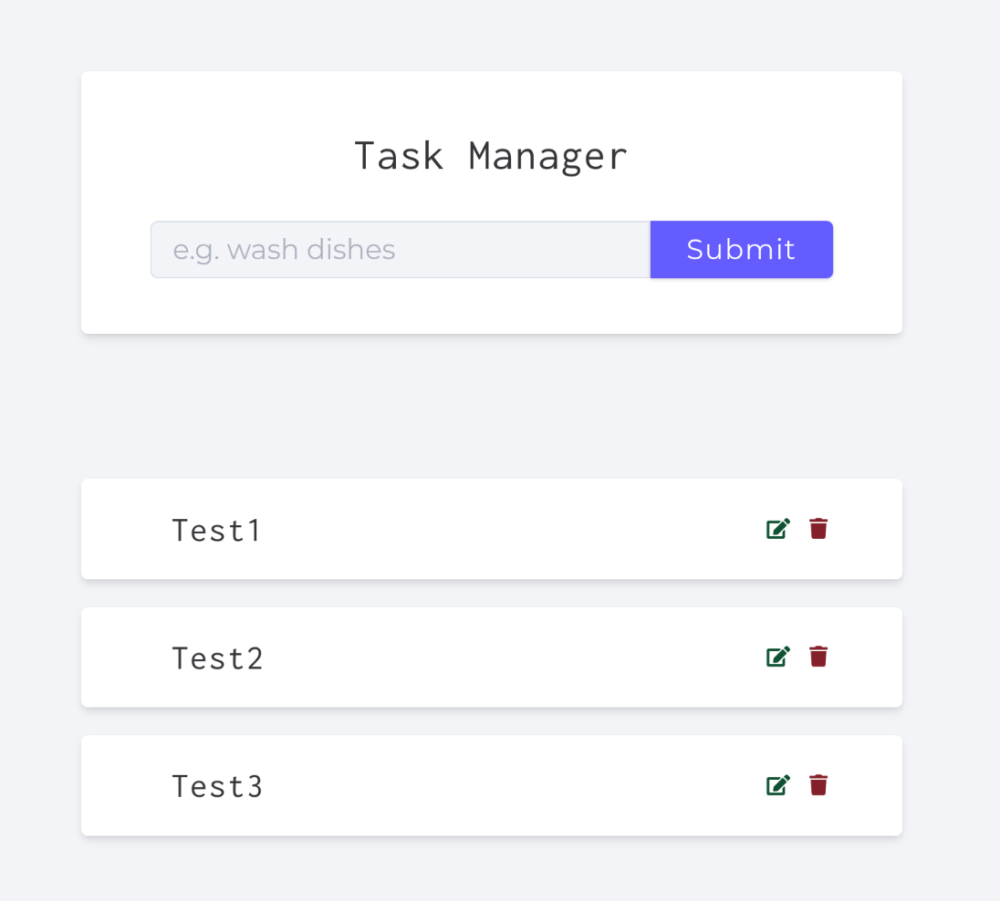

ссылка на репозиторий: https://github.com/dropzed/todo_app


# My Todo Project

Описание проекта: 
- Технологии: Express, Nodemon, JSDOM, MongoDB.
- Проект: Обычная ToDo для записи, имеющая CRUD функционал.

---

---

## 🛠️ Установка и настройка

### 1. Установите зависимости

```bash

npm install
```

### 2. Настройте переменные окружения

Создайте файл `.env` в корне проекта и заполните его согласно примеру:

```bash

cp .env.example .env
```

Откройте файл `.env` и укажите актуальные значения для ваших переменных.

### 3. Запустите проект

```bash

npm start
```
